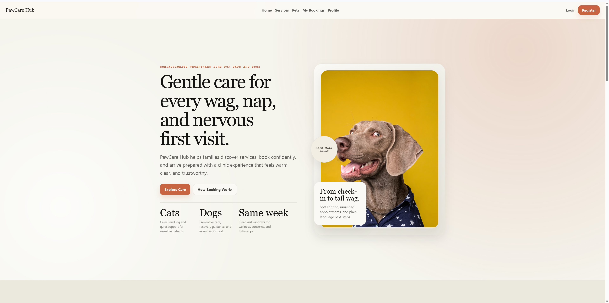
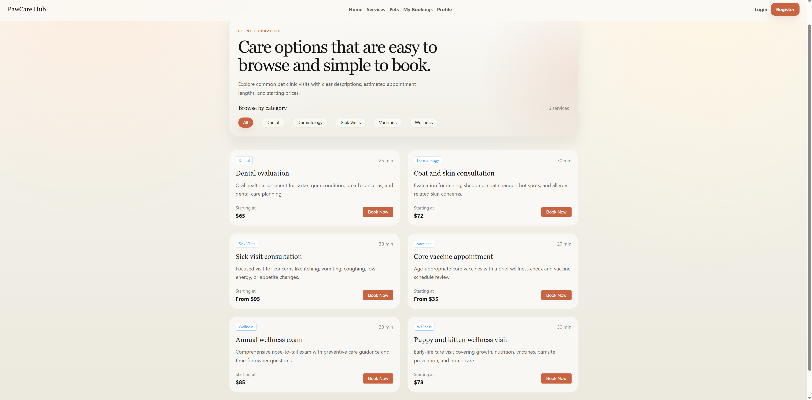
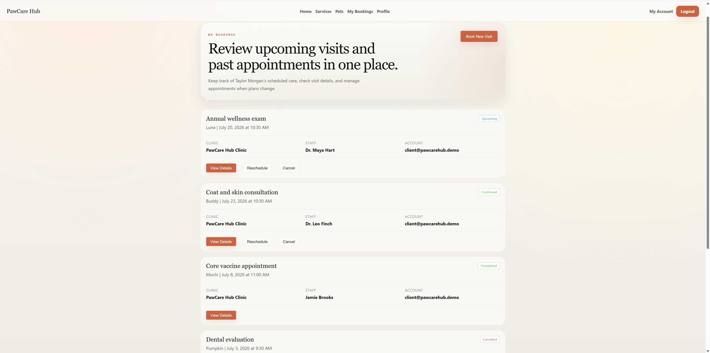
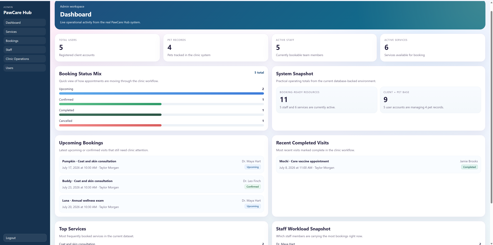
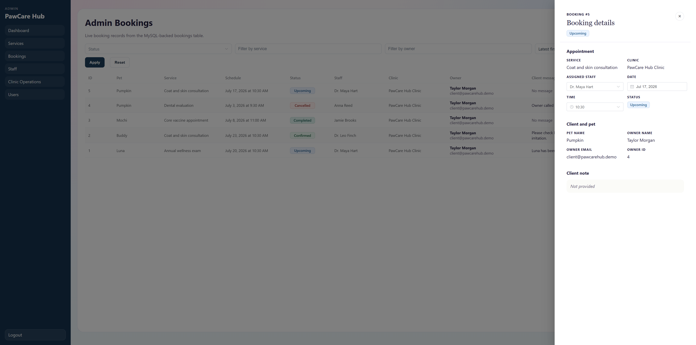
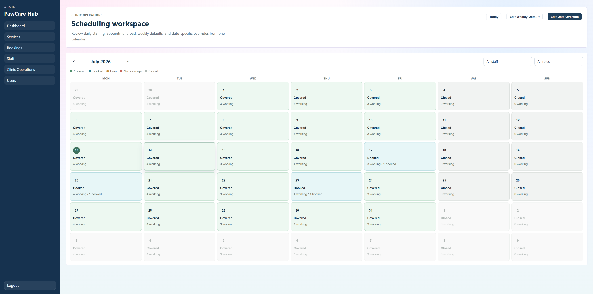
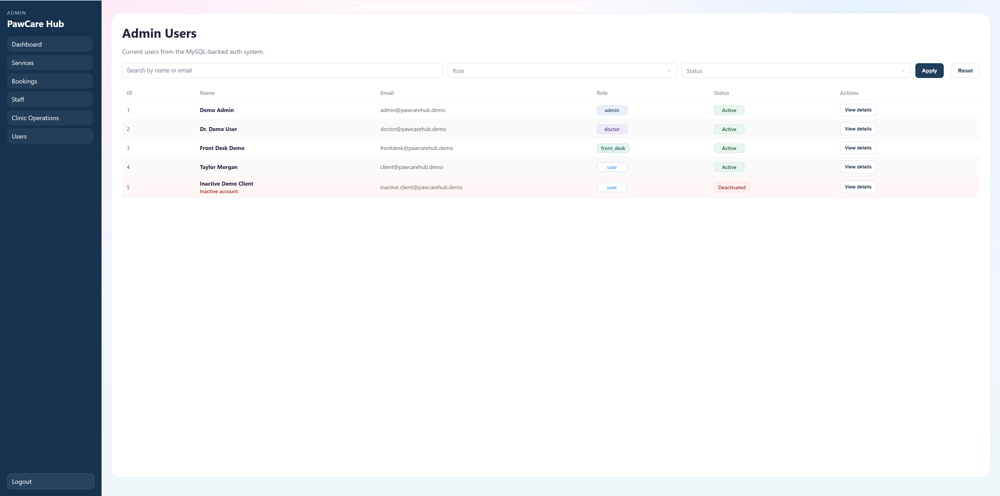

# PawCareHub

PawCareHub is a portfolio-ready full-stack veterinary clinic management system. It brings public service discovery, customer self-service, and clinic operations into one application backed by a Spring Boot API and MySQL.

Customers can manage pets and appointments, while clinic teams can manage services, staff, scheduling, bookings, user access, and day-to-day operational decisions.

## Highlights

- Public landing page and database-backed services catalog
- Secure customer registration and login with JWT authentication
- Customer pet, profile, notification-preference, and booking management
- Admin dashboard with operational statistics and booking visibility
- Service and staff management, including staff availability
- Clinic operations calendar with weekly availability and date-specific overrides
- Editable booking details and scheduling-conflict resolution
- Database-backed access roles and account activation controls
- Controlled, opt-in demo data for portfolio walkthroughs

## Screenshots

Selected screens illustrate the public experience, customer self-service, and the clinic administration workspace.

### Public and customer experience







### Admin workspace









## Technology

| Area | Technologies |
|---|---|
| Frontend | Vue 3, Vite, JavaScript, Pinia, Vue Router, Element Plus, Axios, custom responsive CSS |
| Backend | Java 17, Spring Boot, Spring Security, JWT, Spring Data JPA / Hibernate, Maven |
| Database | MySQL |
| Testing | JUnit 5, Spring Boot Test, MockMvc, H2 test profile |

## Customer features

- Register and log in to a customer account
- Browse public clinic services
- Add, edit, view, and remove pet records
- Create appointments using available staff and time slots
- View, reschedule, and cancel owned bookings
- Manage profile details and notification preferences

## Clinic and admin features

- Dashboard with operational statistics, upcoming bookings, and completed-visit visibility
- Service catalog creation, editing, and activation controls
- Staff management, including active status and availability configuration
- Calendar-based clinic operations for managing schedules
- Booking management, including confirmation, cancellation, and visit completion
- Editable booking-details drawer for operational updates
- Scheduling-conflict detection and resolution
- Customer account deactivation and reactivation
- User management and role updates

## Scheduling workflow

The clinic operations calendar combines each staff member’s weekly availability with date-specific schedule overrides. Customer booking slots are filtered against that effective availability, and the backend validates availability again when an appointment is created or rescheduled.

Before a schedule change is saved, PawCareHub checks it against active bookings. When a change creates a conflict, clinic staff can reassign the affected appointment to an eligible staff member or open the booking for the required changes.

## Role-based access control

PawCareHub stores access roles in the database and enforces authorization in the backend. All public registrations begin with the `user` role. An administrator can change a user’s role from **User Details**.

Email patterns do not grant permissions: access is determined by the database-backed role. Staff profiles are operational records and remain separate from user access roles.

| Role | Main access |
|---|---|
| `user` | Customer app: pets, bookings, profile |
| `doctor` | Admin dashboard, bookings, and clinical outcomes |
| `front_desk` | Admin dashboard, bookings, and clinic operations |
| `admin` | Full admin access, including users, roles, services, staff, and scheduling |

## Demo seed data

Demo data is intentionally opt-in and does not run during normal application startup. Enable the `demo` Spring profile together with `DEMO_SEED_ENABLED=true` to populate a controlled, repeatable walkthrough dataset.

```powershell
cd backend

$env:DB_USERNAME='root'
$env:DB_PASSWORD='your_mysql_password'
$env:DB_NAME='pawcarehub_demo'
$env:SPRING_PROFILES_ACTIVE='demo'
$env:DEMO_SEED_ENABLED='true'

mvn spring-boot:run
```

The demo mode creates accounts for the four roles, including customer and inactive-customer states, plus services, staff availability, pets, and representative booking states. The demo password is `PawCareDemo123!`; demo emails use the `@pawcarehub.demo` domain.

For normal development, omit `SPRING_PROFILES_ACTIVE` and `DEMO_SEED_ENABLED` (or leave the latter as `false`).

## Local development

### Prerequisites

- Node.js and npm
- Java 17
- Maven
- MySQL

### Run the backend

Configure MySQL through environment variables, then start the API:

```powershell
cd backend

$env:DB_USERNAME='root'
$env:DB_PASSWORD='your_mysql_password'
$env:DB_NAME='pawcarehub'

mvn spring-boot:run
```

The backend runs on `http://localhost:8080` by default. Optional variables include `DB_HOST`, `DB_PORT`, and `SERVER_PORT`.

### Run the frontend

From the repository root:

```powershell
npm install
npm run dev
```

Vite serves the frontend on `http://localhost:5173` by default.

## Testing

The backend integration and regression suite covers core customer flows along with role access, account status, booking edits, scheduling conflicts, and demo-data seeding.

```powershell
cd backend
mvn clean test
```

Build the frontend with:

```powershell
npm run build
```

## Repository structure

```text
.
|-- backend/   Spring Boot API, security, persistence, and integration tests
|-- src/       Vue application pages, components, router, stores, and API clients
|-- README.md  Project overview and local setup
```

## Portfolio scope

PawCareHub demonstrates a realistic clinic-management workflow: database-backed application state, customer and staff experiences, role-based backend authorization, scheduling safeguards, and controlled demo data. It is a portfolio project rather than a production clinical system, and does not claim full EMR/EHR, deployment, observability, or operational-compliance coverage.
